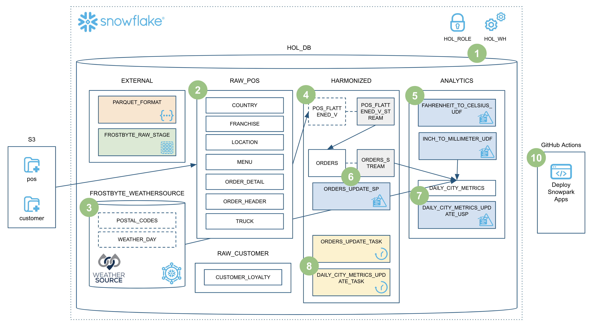

# Data Engineering Pipelines with Snowpark Python
This repository contains the code for the *Data Engineering Pipelines with Snowpark Python* Snowflake Quickstart.

### ➡️ For overview, prerequisites, and to learn more, complete this end-to-end tutorial [Data Engineering Pipelines with Snowpark Python](https://quickstarts.snowflake.com/guide/data_engineering_pipelines_with_snowpark_python/index.html?index=..%2F..index#0) on quickstarts.snowflake.com.

___
Here is an overview of what we'll build in this lab:

Fork repo for Lab 1 : https://github.com/VishalPrasanna11/SnowFlake-Guide-data-engineering-with-snowpark-python.git

Results of Lab1

**Step 1: Fork the repository to create your own copy of the project.**

**Step 2: Set up your CodeSpace environment for development.**

**Step 3: Configure your Snowflake environment with the necessary settings.**

**Step 4: Load the initial data tables into Snowflake.**

**Step 5: Import and process weather data for analysis.**

**Step 6: Create a specialized view for Point of Sale (POS) data.**

**Step 7: Implement a User-Defined Function (UDF) for temperature conversion.**

**Step 8: Create a stored procedure for updating order information.**

**Step 9: Set up daily metrics aggregation for city-level analysis.**

**Step 10.1: Begin orchestrating data pipeline jobs with task scheduling.**

**Step 10.2: Configure dependency chains between tasks in the workflow.**

**Step 10.3: Monitor task execution in the orchestrated pipeline.**

**Step 10.4: Add error handling and notifications to the task workflow.**

**Step 10.5: Implement advanced scheduling options for recurring tasks.**

**Step 10.6: Configure resource allocation for task execution.**

**Step 10.7: Finalize the orchestration with complete task graph visualization.**

**Step 11.1: Begin setting up incremental processing for data efficiency.**

**Step 11.2: Configure change detection for incremental updates.**

**Step 11.3: Implement merge operations for incremental data processing.**

**Step 11.4: Verify the effectiveness of the incremental processing approach.**

**Step 12.1: Set up continuous integration and deployment infrastructure.**

**Step 12.2: Configure automated testing in the CI/CD pipeline.**

**Step 12.3: Deploy the solution to production through the CI/CD pipeline.**

**Step 13: Clean up resources and complete the teardown process.**

